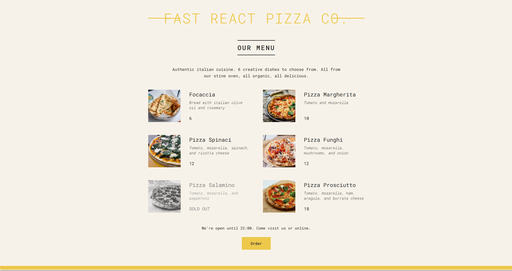

# 🍕 Fast React Pizza Co.

A simple React project for a fictional pizza company. This project displays a dynamic menu with item details, availability, and an order option. Built as part of the **React course by Jonas Schmedtmann on Udemy**.

## 🚀 Project Features

- Built using **React**
- Component-based structure
- Dynamic rendering of pizza data
- Conditional rendering for sold-out items
- Responsive layout with clean UI
- Simple and clear styling

## 📚 What I Learned

Through this project, I practiced and learned:
- JSX and component composition
- Props and dynamic data rendering
- Conditional rendering using JavaScript logic
- Basic project structure and file organization in React
- Working with static assets like images
- Managing reusable UI components

## 🛠️ Tech Stack

- React (via `create-react-app`)
- HTML & CSS
- JavaScript (ES6+)

## 🧑‍🏫 Course Info

This project is part of the following Udemy course:

**[React - The Complete Guide by Jonas Schmedtmann](https://www.udemy.com/course/react-the-complete-guide-incl-redux/)**
